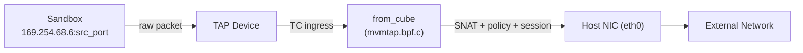
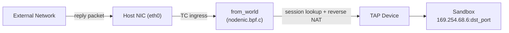
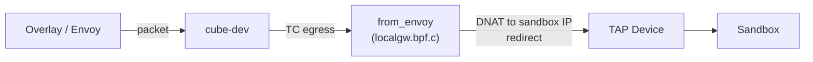
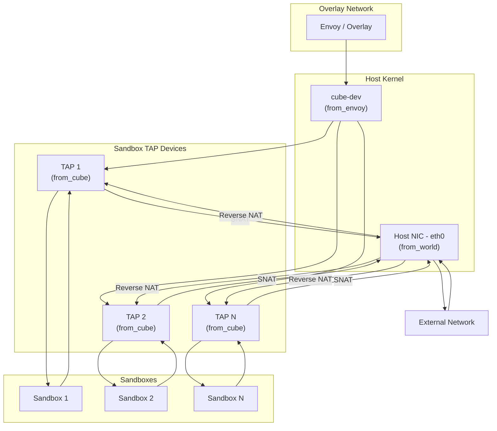

# Network (CubeVS)

Cube-Sandbox isolates each sandbox with its own virtual network, giving every instance private, low-latency connectivity to the outside world while enforcing per-sandbox security policies entirely in kernel space. The subsystem that makes this possible is **CubeVS** -- a purpose-built network virtualization layer composed of three eBPF programs, a set of shared BPF maps, and a Go control-plane library.

This document explains the architecture, traffic paths, NAT model, policy engine, and lifecycle management that together form the CubeVS network.

---

## 1. Architecture Overview

### 1.1 Design Goals

Traditional container networking stacks (Linux Bridge, OVS, iptables-based NAT) add per-packet overhead that grows with the number of tenants on a host. CubeVS replaces that stack with three small, cooperating eBPF programs attached at strategic points in the kernel data path:

- **Point-to-point low latency** -- Each sandbox communicates through a dedicated TAP device; there is no shared bridge and no software switch hop.
- **Kernel-space policy enforcement** -- Network policies are evaluated in eBPF before a packet ever reaches userspace, keeping CPU overhead minimal.
- **Scalable NAT** -- SNAT port allocation uses a lock-protected pool with collision-resistant insertion, avoiding the iptables rule explosion that plagues large deployments.

### 1.2 The Three BPF Programs

CubeVS attaches one BPF program to each of the three network boundaries a packet can cross on a host:

| Program | File | Attach Point | Direction | Role |
|---------|------|-------------|-----------|------|
| `from_cube` | `mvmtap.bpf.c` | TC ingress on each TAP device | Sandbox --> Host | SNAT, policy check, session creation, ARP proxy |
| `from_world` | `nodenic.bpf.c` | TC ingress on host NIC (eth0) | External --> Host | Reverse NAT, port-mapping proxy |
| `from_envoy` | `localgw.bpf.c` | TC egress on cube-dev | Overlay --> Sandbox | DNAT overlay traffic to sandbox IP, redirect to TAP |

### 1.3 The Go Control Plane

The `cubevs/` Go package wraps the BPF lifecycle:

- **`Init()`** loads and pins all three BPF object files, rewrites compile-time constants (IPs, MACs, interface indices), and attaches TC filters.
- **`AddTAPDevice()` / `DelTAPDevice()`** register and deregister sandbox TAP devices, including their metadata and network policies.
- **`AttachFilter()`** creates the clsact qdisc on a TAP device and attaches the `from_cube` TC filter.
- **`SetSNATIPs()`** populates the SNAT IP pool.
- **Network policy and port-mapping APIs** update the corresponding BPF maps at runtime.
- **Session reaper** runs as a background goroutine, periodically sweeping expired NAT sessions.

### 1.4 BPF Maps

Nine pinned BPF maps (under `/sys/fs/bpf/`) form the shared state between the three programs and the Go control plane:

| Map | Type | Key | Value | Purpose |
|-----|------|-----|-------|---------|
| `mvmip_to_ifindex` | Hash | Sandbox IP | TAP ifindex | IP-to-device lookup |
| `ifindex_to_mvmmeta` | Hash | TAP ifindex | Sandbox metadata (IP, ID, version) | Device-to-metadata lookup |
| `egress_sessions` | Hash | 5-tuple (sandbox side) | NAT session state | Track outbound connections |
| `ingress_sessions` | Hash | 5-tuple (external side) | Reverse-lookup metadata | Map reply packets back to sandbox |
| `snat_iplist` | Array | Index (0--3) | SNAT IP entry (IP, ifindex, port waterline) | SNAT IP pool |
| `allow_out` | Hash-of-Maps | TAP ifindex | Inner LPM trie (destination CIDRs) | Per-sandbox allow list |
| `deny_out` | Hash-of-Maps | TAP ifindex | Inner LPM trie (destination CIDRs) | Per-sandbox deny list |
| `remote_port_mapping` | Hash | Host port | TAP ifindex + sandbox listen port | Inbound port forwarding |
| `local_port_mapping` | Hash | TAP ifindex + sandbox listen port | Host port | Outbound port-mapping optimization |

These maps are pinned so that programs loaded at different times (e.g., per-TAP filters loaded after `Init()`) can share state through the filesystem.

---

## 2. Traffic Flows

### 2.1 Egress: Sandbox to External Network

When a sandbox process opens a connection to the internet, the packet takes the following path:



**Step by step:**

1. The sandbox sends a packet with source IP `169.254.68.6` (the fixed internal address) and a source port chosen by its TCP/UDP stack.
2. The packet enters the TAP device and hits the `from_cube` TC ingress filter.
3. `from_cube` checks whether the destination is the sandbox gateway (`169.254.68.5`). If so, this is overlay-bound traffic -- the filter DNATs the destination to cube-dev and redirects the packet there.
4. For all other destinations, `from_cube`:
   - **Evaluates network policy** against the destination IP (see [Section 5](#5-network-policy)).
   - **Creates or updates a NAT session** in `egress_sessions` and `ingress_sessions`.
   - **Performs SNAT**: replaces the sandbox source IP and port with an IP from the SNAT pool and a dynamically allocated port, updating L3 and L4 checksums.
   - **Redirects** the rewritten packet to the host NIC.
5. The packet leaves the host toward the external network.

### 2.2 Ingress: External Network to Sandbox

Reply packets (and port-mapped inbound connections) arrive at the host NIC and are routed back to the correct sandbox:



`from_world` handles two cases:

- **Session-based reverse NAT** -- The filter looks up the packet's 5-tuple in `ingress_sessions`. If a match is found, it reconstructs the original sandbox-side 5-tuple, performs reverse DNAT (rewriting destination IP and port back to the sandbox's internal address), and redirects the packet to the correct TAP device.
- **Port-mapped proxy** -- If no session matches, the filter checks `remote_port_mapping` using the destination port. A match means this is an inbound connection to a service the sandbox is exposing. The filter DNATs the packet to the sandbox's listen port and redirects to the TAP.

### 2.3 Overlay Traffic: Envoy to Sandbox

Traffic arriving from the overlay network (e.g., from a sidecar proxy) enters through cube-dev:



`from_envoy` rewrites the destination IP from the overlay address to the sandbox's internal IP (`169.254.68.6`), sets the source to the gateway IP (`169.254.68.5`), and redirects the packet to the appropriate TAP device by looking up `mvmip_to_ifindex`.

---

## 3. Session Tracking

CubeVS maintains stateful connection tracking so that reply packets can be correctly reverse-NATed and so that the system can detect and clean up stale connections.

### 3.1 Dual-Map Design

Two maps work in tandem:

- **`egress_sessions`** is the primary session table. The key is the original 5-tuple as seen from the sandbox side (sandbox IP, destination IP, sandbox port, destination port, protocol, and a version field for multi-version support). The value holds the full NAT state: SNAT IP and port, TAP ifindex, timestamps, TCP state, and a flag for active-close handling.
- **`ingress_sessions`** is the reverse-lookup table. The key is the 5-tuple as seen from the external side (external IP, node IP, external port, SNAT port, protocol). The value stores just enough information (sandbox IP, sandbox port, version) to reconstruct the `egress_sessions` key and perform the reverse NAT.

This dual-map approach avoids duplicating the full session state in both directions while still enabling efficient O(1) lookups from either side of the connection.

### 3.2 TCP State Machine

CubeVS implements a TCP connection-tracking state machine modeled after the Linux kernel's `nf_conntrack`. It recognizes 11 states, including `SYN_SENT`, `SYN_RECV`, `ESTABLISHED`, `FIN_WAIT`, `CLOSE_WAIT`, `LAST_ACK`, `TIME_WAIT`, `CLOSE`, and `SYN_SENT2` (for simultaneous open). State transitions are driven by the TCP flags observed in both the original (sandbox-to-external) and reply (external-to-sandbox) directions.

This level of tracking is important for two reasons:

1. **Accurate timeouts** -- An `ESTABLISHED` session can safely live for hours (default: 3 hours), while a half-open `SYN_SENT` session should be reaped after 1 minute.
2. **Active-close detection** -- When the sandbox initiates the close (sends the first FIN), the session enters `TIME_WAIT` and lingers briefly to absorb retransmissions. When the external side initiates, the session enters `CLOSE_WAIT` / `LAST_ACK` with shorter timeouts.

### 3.3 UDP and ICMP Tracking

**UDP** uses a simple two-state model:
- `UNREPLIED` -- set when the first outbound packet is seen.
- `REPLIED` -- set when the first reply arrives. Timeout extends from 30 seconds (unreplied) to 180 seconds (replied).

**ICMP** also uses two states (`UNREPLIED` / `REPLIED`) with a fixed 30-second timeout. The ICMP echo identifier serves as the "port" in the session key, so concurrent pings from the same sandbox are tracked independently.

### 3.4 Session Reaper

A Go background goroutine runs every 5 seconds and walks the `egress_sessions` map. For each session it compares `now - access_time` against a state-specific timeout:

| Protocol | State | Timeout |
|----------|-------|---------|
| TCP | SYN_SENT, SYN_RECV | 1 minute |
| TCP | ESTABLISHED | 3 hours |
| TCP | FIN_WAIT, CLOSE_WAIT, LAST_ACK | 1--2 minutes |
| TCP | TIME_WAIT, CLOSE | 10 seconds |
| UDP | UNREPLIED | 30 seconds |
| UDP | REPLIED | 180 seconds |
| ICMP | Any | 30 seconds |

When a session expires, the reaper deletes both the `egress_sessions` and `ingress_sessions` entries. If the session was not in a normal terminal state (e.g., `ESTABLISHED` timing out without a FIN), the reaper logs a warning. It also monitors session count and alerts when occupancy exceeds 80% of the map's capacity.

---

## 4. SNAT and DNAT

### 4.1 SNAT: Outbound Address Translation

Every outbound packet from a sandbox must be rewritten with a routable source address before it can leave the host. CubeVS performs this in `from_cube` using a pool of up to four SNAT IPs.

**IP selection** is deterministic per sandbox: `index = jhash(sandbox_ip) % 4`. This ensures that all connections from the same sandbox use the same SNAT IP, which simplifies external firewall rules and logging.

**Port allocation** works as a monotonically increasing waterline per SNAT IP entry. The waterline starts at port 30000 and increments with each new connection. When it reaches 65535 it wraps around. The SNAT entry is protected by a BPF spin lock so that concurrent allocations on different CPUs do not race.

**Collision avoidance** is handled at insertion time. After selecting a port, the BPF program attempts to insert the reverse-lookup entry into `ingress_sessions` using the `BPF_NOEXIST` flag. If the key already exists (meaning another session is already using that SNAT IP:port combination for the same external endpoint), the allocator increments the port and retries, up to 10 attempts. If all 10 fail, the packet is dropped.

After a successful allocation, `from_cube` updates the IP header (source IP and checksum) and the transport header (source port and checksum) in place, then redirects the packet to the host NIC.

### 4.2 DNAT: Inbound Address Translation

DNAT occurs in two contexts:

1. **Overlay traffic** (`from_envoy` on cube-dev) -- The destination IP is rewritten from the overlay address to the sandbox's internal IP (`169.254.68.6`), and the source is set to the gateway address (`169.254.68.5`). The packet is redirected to the correct TAP device.

2. **Session reply traffic** (`from_world` on host NIC) -- The destination IP and port are rewritten from the node's SNAT address back to the sandbox's original source address and port. The reaper has not yet cleaned the session, so the reverse-lookup in `ingress_sessions` provides the sandbox-side coordinates.

3. **Port-mapped traffic** (`from_world` on host NIC) -- For services exposed via port mapping, the destination is rewritten to the sandbox's listen port. No session table is involved; the `remote_port_mapping` map provides the translation directly.

---

## 5. Network Policy

CubeVS enforces per-sandbox outbound network policies entirely in kernel space, using LPM (Longest Prefix Match) tries for CIDR-based rules.

### 5.1 Architecture

Each sandbox can have two LPM tries associated with its TAP device:

- **`allow_out`** -- An allow list of destination CIDRs. If this map exists and the destination matches, the packet is allowed regardless of the deny list.
- **`deny_out`** -- A deny list of destination CIDRs. If this map exists and the destination matches (and it was not in the allow list), the packet is dropped.

Both are implemented as hash-of-maps: the outer map is keyed by TAP ifindex, and each value is a file descriptor to an inner LPM trie. This per-device structure means that policy updates for one sandbox do not require iterating over or locking maps belonging to other sandboxes.

### 5.2 Evaluation Order

```
1. Is the destination the sandbox gateway (169.254.68.5)?
   --> YES: Allow (internal traffic, always permitted)
   
2. Does the sandbox have an allow_out map, and does the destination match?
   --> YES: Allow
   
3. Does the sandbox have a deny_out map, and does the destination match?
   --> YES: Drop
   
4. Default: Allow
```

The priority is: **allow > deny > default-allow**. This means a sandbox operator can set a broad deny rule (e.g., `0.0.0.0/0` to block all internet access) and then punch specific holes with allow rules.

### 5.3 Always-Denied CIDRs

Regardless of policy configuration, CubeVS prevents sandboxes from reaching private and link-local address ranges:

- `10.0.0.0/8`
- `127.0.0.0/8`
- `169.254.0.0/16`
- `172.16.0.0/12`
- `192.168.0.0/16`

These ranges are added to the deny list during `AddTAPDevice()` and cannot be overridden by allow rules. This ensures that a sandbox cannot probe the host's internal network or other sandboxes' link-local addresses.

### 5.4 Policy Configuration

When a TAP device is registered, the caller provides an `MVMOptions` struct:

- **`AllowInternetAccess`** -- If `false`, a blanket deny rule (`0.0.0.0/0`) is installed.
- **`AllowOut`** -- A list of CIDRs to add to the allow list.
- **`DenyOut`** -- A list of CIDRs to add to the deny list.

Policies can be updated at runtime by modifying the inner LPM tries without detaching or reloading BPF programs.

---

## 6. Port Mapping

Sandboxes are not directly reachable from outside the host. When a sandbox needs to expose a service (e.g., an HTTP server), CubeVS provides port mapping -- a static NAT rule that forwards traffic arriving at a specific host port to a specific sandbox port.

### 6.1 Dual Mappings

Two BPF maps support port mapping:

- **`remote_port_mapping`** maps a host port to a (TAP ifindex, sandbox listen port) pair. This is used by `from_world` to route inbound connections to the right sandbox.
- **`local_port_mapping`** maps (TAP ifindex, sandbox listen port) back to the host port. This is used by `from_cube` as an optimization: when a sandbox sends a packet from a mapped listen port, the filter can skip full NAT session creation and directly SNAT the packet to the node IP with the correct port, then redirect to the host NIC.

### 6.2 Inbound Proxy Flow

1. An external client sends a packet to `node_ip:host_port`.
2. `from_world` looks up `remote_port_mapping[host_port]`.
3. On a match, the filter rewrites the destination to `169.254.68.6:sandbox_listen_port` and redirects to the TAP device.
4. The sandbox receives the connection on its listen port.

This path does not create entries in the session tables, which keeps the maps lean for long-lived service connections.

### 6.3 Management

The Go API provides `AddPortMapping()`, `DelPortMapping()`, `ListPortMapping()`, and `GetPortMapping()` for managing mappings at runtime.

### 6.4 Compute-Node Port Allocation

To prevent collisions between subsystems, the host's usable port space is partitioned into three ranges:

| Port range | Purpose | Allocator |
|------------|---------|-----------|
| `10000`--`19999` | `ip_local_port_range` (host ephemeral ports) | Set by network-agent at startup |
| `20000`--`29999` | Ports CubeProxy uses to reach sandboxes | Allocated by network-agent when a sandbox is created |
| `30000`--`65535` | Source ports used by host SNAT for sandbox-originated traffic | Allocated by CubeVS during SNAT |

---

## 7. TAP Device Lifecycle

Each sandbox gets a dedicated TAP device that serves as its sole network interface on the host side. CubeVS manages the full lifecycle of these devices.

### 7.1 Registration: AddTAPDevice

When the sandbox runtime (Cubelet) creates a new sandbox, it calls `AddTAPDevice(ifindex, ip, id, version, options)`:

1. The sandbox's metadata (IP, UUID, version) is written to `ifindex_to_mvmmeta`.
2. The IP-to-device mapping is written to `mvmip_to_ifindex`.
3. Network policy inner maps are initialized based on `MVMOptions` -- always-denied CIDRs are installed first, then any caller-specified allow or deny rules.

### 7.2 Filter Attachment: AttachFilter

After the TAP device is created at the OS level, `AttachFilter(ifindex)` loads the pinned `from_cube` BPF program and attaches it:

1. A clsact qdisc is created on the TAP device (if one does not already exist).
2. The `from_cube` TC filter is attached to the ingress hook of the qdisc.
3. The inner LPM tries for `allow_out` and `deny_out` are created and linked to the outer hash-of-maps.

From this point on, every packet the sandbox sends is intercepted by `from_cube`.

### 7.3 Teardown: DelTAPDevice

When a sandbox is destroyed, `DelTAPDevice(ifindex, ip)`:

1. Removes the network policy inner maps (the inner LPM tries are deleted from the hash-of-maps).
2. Deletes the `ifindex_to_mvmmeta` and `mvmip_to_ifindex` entries.
3. Any active sessions referencing this TAP device are left in place -- the session reaper will clean them up when they time out. This avoids the need for an expensive full-map scan at teardown time.

---

## 8. Initialization

### 8.1 The Init() Flow

`Init()` is called once when the network agent starts. It performs the system-level setup that must happen before any sandboxes can be created:

1. **Load BPF objects** -- The three object files (localgw, mvmtap, nodenic) are loaded into the kernel. Before loading, the Go library rewrites compile-time constants in the BPF bytecode with the actual values for this host:
   - Sandbox internal IP (`169.254.68.6`) and gateway IP (`169.254.68.5`)
   - Sandbox MAC address
   - cube-dev interface index, IP, and MAC
   - Host NIC interface index, IP, MAC, and next-hop gateway MAC

2. **Pin programs and maps** -- All programs and maps are pinned under `/sys/fs/bpf/` so that programs loaded later (per-TAP filters) can access the shared maps by path.

3. **Attach TC filters** --
   - `from_envoy` is attached to cube-dev's TC egress hook (handling overlay-to-sandbox traffic).
   - `from_world` is attached to the host NIC's TC ingress hook (handling external-to-sandbox reply traffic).
   - `from_world` is also attached to the loopback interface for completeness.

### 8.2 Constant Rewriting

BPF programs cannot read configuration files at runtime. Instead, CubeVS uses a pattern common in the eBPF ecosystem: global variables in the BPF C source are compiled as constants, and the Go loader rewrites their values in the ELF object before loading it into the kernel. This approach gives the programs the performance of compile-time constants (the verifier can optimize branches) with the flexibility of runtime configuration.

---

## 9. ARP Proxy

Sandboxes are assigned a link-local IP (`169.254.68.6`) and use `169.254.68.5` as their default gateway. Since these addresses exist only inside the TAP device's point-to-point link, there is no real host at `169.254.68.5` to respond to ARP requests. CubeVS solves this with an ARP proxy built into the `from_cube` filter.

### 9.1 How It Works

1. The sandbox's network stack sends an ARP request: *"Who has 169.254.68.5? Tell 169.254.68.6."*
2. `from_cube` detects the ARP request, swaps the sender and target IP addresses to form an ARP reply, and fills in the sender MAC with the cube-dev gateway MAC address.
3. The reply is redirected back out the same TAP device (egress direction), arriving at the sandbox as if a real gateway had responded.

The sandbox now has a valid ARP entry for its default gateway and can send IP packets to any destination. Those packets are routed through the TAP, intercepted by `from_cube`, SNATed, and forwarded to the host NIC -- completing the egress path described in Section 2.1.

### 9.2 Why an ARP Proxy

In a traditional bridge-based setup, ARP is resolved by the bridge forwarding requests to all ports. CubeVS does not use a bridge; each TAP is an isolated point-to-point link. The ARP proxy is the minimal mechanism needed to make IP routing work over this link without introducing any broadcast domain or shared L2 segment.

---

## 10. Summary

CubeVS achieves sandbox network isolation through a three-layer eBPF architecture:



The key design principles are:

- **All data-path logic in kernel space** -- Policy evaluation, NAT, session tracking, and ARP resolution happen in eBPF with no context switches to userspace.
- **Per-sandbox isolation** -- Each sandbox has its own TAP device, its own policy tries, and its own sessions. There is no shared bridge or switch.
- **Stateful connection tracking** -- A dual-map session model (egress + ingress) enables bidirectional NAT with O(1) lookups and accurate protocol-aware timeouts.
- **Minimal control plane** -- The Go library handles initialization, device lifecycle, and periodic session cleanup. The steady-state data path is entirely in eBPF.
