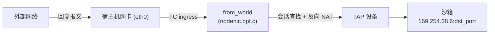
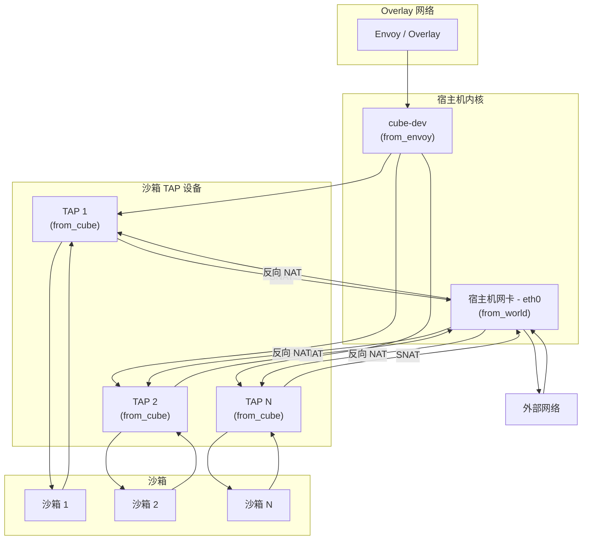

# 网络模型 (CubeVS)

Cube-Sandbox 为每个沙箱提供独立的虚拟网络，使其拥有私有且低延迟的外部连接能力，同时完全在内核态执行逐沙箱的安全策略。实现这一切的子系统称为 **CubeVS** —— 一个专为沙箱场景设计的网络虚拟化层，由三个 eBPF 程序、一组共享的 BPF Map 和一个 Go 控制面库组成。

本文档介绍 CubeVS 的整体架构、流量路径、NAT 模型、策略引擎以及设备生命周期管理。

---

## 1. 架构概览

### 1.1 设计目标

传统的容器网络方案（Linux Bridge、OVS、基于 iptables 的 NAT）在每个报文上都会引入额外开销，并且开销会随主机上租户数量的增长而加剧。CubeVS 用三个精简的 eBPF 程序取代了这一整套网络栈，它们被挂载在内核数据路径的关键位置上，协同工作：

- **点对点低延迟** —— 每个沙箱通过专属的 TAP 设备通信，没有共享网桥，也没有软件交换机的额外一跳。
- **内核态策略执行** —— 网络策略在 eBPF 中完成评估，报文无需到达用户态，CPU 开销极低。
- **可扩展的 NAT** —— SNAT 端口分配使用带自旋锁保护的资源池和防碰撞插入机制，避免了大规模部署中 iptables 规则膨胀的问题。

### 1.2 三个 BPF 程序

CubeVS 在报文可能经过的三个网络边界上各挂载一个 BPF 程序：

| 程序 | 源文件 | 挂载点 | 方向 | 职责 |
|------|--------|--------|------|------|
| `from_cube` | `mvmtap.bpf.c` | 各 TAP 设备的 TC ingress | 沙箱 --> 宿主机 | SNAT、策略检查、会话创建、ARP 代理 |
| `from_world` | `nodenic.bpf.c` | 宿主机网卡 (eth0) 的 TC ingress | 外部 --> 宿主机 | 反向 NAT、端口映射代理 |
| `from_envoy` | `localgw.bpf.c` | cube-dev 的 TC egress | Overlay --> 沙箱 | 将 Overlay 流量 DNAT 到沙箱 IP 并重定向至 TAP |

### 1.3 Go 控制面

`cubevs/` Go 包封装了 BPF 的生命周期管理：

- **`Init()`** 加载并固定三个 BPF 目标文件，改写编译期常量（IP、MAC、接口索引），并挂载 TC 过滤器。
- **`AddTAPDevice()` / `DelTAPDevice()`** 注册和注销沙箱 TAP 设备，包括其元数据和网络策略。
- **`AttachFilter()`** 在 TAP 设备上创建 clsact qdisc，并挂载 `from_cube` TC 过滤器。
- **`SetSNATIPs()`** 填充 SNAT IP 池。
- **网络策略与端口映射 API** 在运行时更新对应的 BPF Map。
- **会话回收器** 以后台 goroutine 方式运行，定期清理过期的 NAT 会话。

### 1.4 BPF Map

九个固定在 `/sys/fs/bpf/` 下的 BPF Map 构成了三个程序与 Go 控制面之间的共享状态：

| Map | 类型 | Key | Value | 用途 |
|-----|------|-----|-------|------|
| `mvmip_to_ifindex` | Hash | 沙箱 IP | TAP ifindex | IP 到设备的映射 |
| `ifindex_to_mvmmeta` | Hash | TAP ifindex | 沙箱元数据（IP、ID、版本） | 设备到元数据的映射 |
| `egress_sessions` | Hash | 五元组（沙箱侧） | NAT 会话状态 | 跟踪出站连接 |
| `ingress_sessions` | Hash | 五元组（外部侧） | 反向查找元数据 | 将回复报文映射回沙箱 |
| `snat_iplist` | Array | 索引（0--3） | SNAT IP 条目（IP、ifindex、端口水位线） | SNAT IP 池 |
| `allow_out` | Hash-of-Maps | TAP ifindex | 内部 LPM Trie（目标 CIDR） | 逐沙箱允许列表 |
| `deny_out` | Hash-of-Maps | TAP ifindex | 内部 LPM Trie（目标 CIDR） | 逐沙箱拒绝列表 |
| `remote_port_mapping` | Hash | 宿主端口 | TAP ifindex + 沙箱监听端口 | 入站端口转发 |
| `local_port_mapping` | Hash | TAP ifindex + 沙箱监听端口 | 宿主端口 | 出站端口映射优化 |

这些 Map 通过文件系统固定，使得在不同时间加载的程序（例如 `Init()` 之后才加载的逐 TAP 过滤器）能够共享状态。

---

## 2. 流量路径

### 2.1 出站：沙箱到外部网络

当沙箱进程发起到互联网的连接时，报文经过以下路径：


**详细步骤：**

1. 沙箱发送报文，源 IP 为 `169.254.68.6`（固定内部地址），源端口由其 TCP/UDP 栈选择。
2. 报文进入 TAP 设备，命中 `from_cube` TC ingress 过滤器。
3. `from_cube` 首先检查目标是否为沙箱网关（`169.254.68.5`）。若是，说明这是 Overlay 流量 —— 过滤器将目标 DNAT 到 cube-dev 并重定向报文。
4. 对于其他目标，`from_cube` 依次执行：
   - **评估网络策略**，根据目标 IP 决定放行或丢弃（详见[第 5 节](#5-网络策略)）。
   - **创建或更新 NAT 会话**，写入 `egress_sessions` 和 `ingress_sessions`。
   - **执行 SNAT**：将沙箱源 IP 和端口替换为 SNAT 池中的 IP 及动态分配的端口，同时更新 L3 和 L4 校验和。
   - **重定向**改写后的报文到宿主机网卡。
5. 报文离开宿主机，发往外部网络。

### 2.2 入站：外部网络到沙箱

回复报文（以及端口映射的入站连接）到达宿主机网卡，被路由回正确的沙箱：



`from_world` 处理两种情况：

- **基于会话的反向 NAT** —— 过滤器在 `ingress_sessions` 中查找报文的五元组。若匹配成功，则重建沙箱侧的原始五元组，执行反向 DNAT（将目标 IP 和端口改写回沙箱内部地址），并重定向报文到正确的 TAP 设备。
- **端口映射代理** —— 若会话未匹配，过滤器根据目标端口查找 `remote_port_mapping`。若匹配成功，说明这是沙箱对外暴露服务的入站连接。过滤器将目标 DNAT 到沙箱的监听端口并重定向至 TAP。

### 2.3 Overlay 流量：Envoy 到沙箱

来自 Overlay 网络的流量（例如来自 Sidecar 代理）通过 cube-dev 进入：


`from_envoy` 将目标 IP 从 Overlay 地址改写为沙箱内部 IP（`169.254.68.6`），源地址设为网关 IP（`169.254.68.5`），然后通过查找 `mvmip_to_ifindex` 将报文重定向到对应的 TAP 设备。

---

## 3. 会话跟踪

CubeVS 维护有状态的连接跟踪，以确保回复报文能够被正确地执行反向 NAT，同时系统能够检测和清理过期连接。

### 3.1 双 Map 设计

两个 Map 协同工作：

- **`egress_sessions`** 是主会话表。Key 为沙箱侧的原始五元组（沙箱 IP、目标 IP、沙箱端口、目标端口、协议，以及用于多版本支持的 version 字段）。Value 保存完整的 NAT 状态：SNAT IP 和端口、TAP ifindex、时间戳、TCP 状态以及主动关闭标志。
- **`ingress_sessions`** 是反向查找表。Key 为外部侧的五元组（外部 IP、节点 IP、外部端口、SNAT 端口、协议）。Value 仅存储足以重建 `egress_sessions` Key 的信息（沙箱 IP、沙箱端口、version）。

这种双 Map 方案避免了在两个方向上重复存储完整的会话状态，同时仍能从连接的任意一端实现 O(1) 查找。

### 3.2 TCP 状态机

CubeVS 实现了一个参照 Linux 内核 `nf_conntrack` 的 TCP 连接跟踪状态机，识别 11 种状态，包括 `SYN_SENT`、`SYN_RECV`、`ESTABLISHED`、`FIN_WAIT`、`CLOSE_WAIT`、`LAST_ACK`、`TIME_WAIT`、`CLOSE` 和 `SYN_SENT2`（同时打开场景）。状态转换由两个方向（original：沙箱到外部，reply：外部到沙箱）观察到的 TCP 标志驱动。

如此精细的跟踪有两个关键作用：

1. **精确的超时控制** —— `ESTABLISHED` 状态的会话可以安全存活数小时（默认 3 小时），而半打开的 `SYN_SENT` 会话应在 1 分钟后被回收。
2. **主动关闭检测** —— 当沙箱发起关闭（发送第一个 FIN）时，会话进入 `TIME_WAIT` 状态并短暂保留以吸收重传。当外部侧发起关闭时，会话进入 `CLOSE_WAIT` / `LAST_ACK` 状态，超时时间更短。

### 3.3 UDP 和 ICMP 跟踪

**UDP** 使用简单的两状态模型：
- `UNREPLIED` —— 首个出站报文出现时设置。
- `REPLIED` —— 首个回复到达时设置。超时从 30 秒（未回复）延长至 180 秒（已回复）。

**ICMP** 同样使用两个状态（`UNREPLIED` / `REPLIED`），固定 30 秒超时。ICMP Echo 标识符用作会话 Key 中的"端口"，因此同一沙箱的并发 ping 请求能被独立跟踪。

### 3.4 会话回收器

一个 Go 后台 goroutine 每 5 秒执行一次，遍历 `egress_sessions` Map。对于每个会话，它比较 `当前时间 - access_time` 与特定状态的超时值：

| 协议 | 状态 | 超时 |
|------|------|------|
| TCP | SYN_SENT、SYN_RECV | 1 分钟 |
| TCP | ESTABLISHED | 3 小时 |
| TCP | FIN_WAIT、CLOSE_WAIT、LAST_ACK | 1--2 分钟 |
| TCP | TIME_WAIT、CLOSE | 10 秒 |
| UDP | UNREPLIED | 30 秒 |
| UDP | REPLIED | 180 秒 |
| ICMP | 任意 | 30 秒 |

当会话过期时，回收器同时删除 `egress_sessions` 和 `ingress_sessions` 中的条目。若会话不在正常终止状态（例如 `ESTABLISHED` 未经 FIN 即超时），回收器会记录告警。它还会监控会话数量，当占用率超过 Map 容量的 80% 时发出告警。

---

## 4. SNAT 与 DNAT

### 4.1 SNAT：出站地址转换

沙箱的每个出站报文在离开宿主机前，必须将源地址改写为可路由地址。CubeVS 在 `from_cube` 中使用最多四个 SNAT IP 的地址池完成此操作。

**IP 选择**按沙箱确定性分配：`index = jhash(sandbox_ip) % 4`。这确保同一沙箱的所有连接使用相同的 SNAT IP，简化了外部防火墙规则和日志记录。

**端口分配**使用逐 SNAT IP 条目的单调递增水位线。水位线从端口 30000 开始，每次新建连接时递增。到达 65535 时回绕。SNAT 条目受 BPF 自旋锁保护，确保不同 CPU 上的并发分配不会产生竞争。

**碰撞避免**在插入时处理。选定端口后，BPF 程序尝试使用 `BPF_NOEXIST` 标志将反向查找条目插入 `ingress_sessions`。若 Key 已存在（表示另一会话已在相同外部端点上使用了该 SNAT IP:端口组合），分配器递增端口并重试，最多尝试 10 次。若 10 次均失败，报文将被丢弃。

分配成功后，`from_cube` 原地更新 IP 头（源 IP 和校验和）与传输层头（源端口和校验和），然后将报文重定向到宿主机网卡。

### 4.2 DNAT：入站地址转换

DNAT 发生在三种场景中：

1. **Overlay 流量**（cube-dev 上的 `from_envoy`）—— 目标 IP 从 Overlay 地址改写为沙箱内部 IP（`169.254.68.6`），源地址设为网关地址（`169.254.68.5`）。报文被重定向到正确的 TAP 设备。

2. **会话回复流量**（宿主机网卡上的 `from_world`）—— 目标 IP 和端口从节点的 SNAT 地址改写回沙箱的原始源地址和端口。`ingress_sessions` 中的反向查找提供了沙箱侧的坐标。

3. **端口映射流量**（宿主机网卡上的 `from_world`）—— 对于通过端口映射暴露的服务，目标被改写为沙箱的监听端口。无需会话表参与，`remote_port_mapping` Map 直接提供转换。

---

## 5. 网络策略

CubeVS 完全在内核态执行逐沙箱的出站网络策略，使用 LPM（最长前缀匹配）Trie 实现基于 CIDR 的规则。

### 5.1 架构

每个沙箱可以为其 TAP 设备关联两个 LPM Trie：

- **`allow_out`** —— 目标 CIDR 的允许列表。若此 Map 存在且目标匹配，报文将被放行，不再检查拒绝列表。
- **`deny_out`** —— 目标 CIDR 的拒绝列表。若此 Map 存在且目标匹配（且未在允许列表中），报文将被丢弃。

两者均实现为 Hash-of-Maps：外层 Map 以 TAP ifindex 为 Key，每个 Value 是内层 LPM Trie 的文件描述符。这种逐设备结构意味着一个沙箱的策略更新无需遍历或锁定其他沙箱的 Map。

### 5.2 评估顺序

```
1. 目标是否为沙箱网关（169.254.68.5）？
   --> 是：放行（内部流量，始终允许）
   
2. 沙箱是否有 allow_out Map，且目标是否匹配？
   --> 是：放行
   
3. 沙箱是否有 deny_out Map，且目标是否匹配？
   --> 是：丢弃
   
4. 默认：放行
```

优先级为：**允许 > 拒绝 > 默认放行**。这意味着沙箱运维人员可以设置宽泛的拒绝规则（例如 `0.0.0.0/0` 阻止所有互联网访问），然后通过允许规则开放特定白名单。

### 5.3 始终拒绝的 CIDR

无论策略如何配置，CubeVS 都会阻止沙箱访问私有和链路本地地址段：

- `10.0.0.0/8`
- `127.0.0.0/8`
- `169.254.0.0/16`
- `172.16.0.0/12`
- `192.168.0.0/16`

这些地址段在 `AddTAPDevice()` 期间被添加到拒绝列表，且无法被允许规则覆盖。这确保了沙箱无法探测宿主机的内部网络或其他沙箱的链路本地地址。

### 5.4 策略配置

注册 TAP 设备时，调用方提供 `MVMOptions` 结构体：

- **`AllowInternetAccess`** —— 若为 `false`，安装全面拒绝规则（`0.0.0.0/0`）。
- **`AllowOut`** —— 需添加到允许列表的 CIDR 列表。
- **`DenyOut`** —— 需添加到拒绝列表的 CIDR 列表。

策略可在运行时通过修改内层 LPM Trie 进行更新，无需卸载或重新加载 BPF 程序。

---

## 6. 端口映射

沙箱无法从宿主机外部直接访问。当沙箱需要暴露服务（如 HTTP 服务器）时，CubeVS 提供端口映射 —— 一条静态 NAT 规则，将到达宿主机特定端口的流量转发到沙箱的特定端口。

### 6.1 双向映射

两个 BPF Map 支撑端口映射：

- **`remote_port_mapping`** 将宿主端口映射到（TAP ifindex，沙箱监听端口）。`from_world` 用它将入站连接路由到正确的沙箱。
- **`local_port_mapping`** 将（TAP ifindex，沙箱监听端口）映射回宿主端口。`from_cube` 将其用作优化：当沙箱从已映射的监听端口发送报文时，过滤器可跳过完整的 NAT 会话创建，直接将报文 SNAT 到节点 IP 的正确端口并重定向到宿主机网卡。

### 6.2 入站代理流程

1. 外部客户端发送报文到 `node_ip:host_port`。
2. `from_world` 查找 `remote_port_mapping[host_port]`。
3. 若匹配，过滤器将目标改写为 `169.254.68.6:sandbox_listen_port` 并重定向到 TAP 设备。
4. 沙箱在其监听端口上收到连接。

此路径不会在会话表中创建条目，使 Map 在长连接服务场景下保持精简。

### 6.3 管理

Go API 提供了 `AddPortMapping()`、`DelPortMapping()`、`ListPortMapping()` 和 `GetPortMapping()`，用于在运行时管理映射关系。

### 6.4 计算节点端口分配

为避免不同子系统之间的端口冲突，计算节点上的可用端口被划分为三段：

| 端口范围 | 用途 | 分配者 |
|----------|------|--------|
| `10000`--`19999` | `ip_local_port_range`（宿主机临时端口） | 由 network-agent 启动时修改 |
| `20000`--`29999` | CubeProxy 访问沙箱所用的端口范围 | 由 network-agent 在创建沙箱时分配 |
| `30000`--`65535` | 沙箱出站报文经主机 NAT 时使用的端口范围 | 由 CubeVS 在 SNAT 时分配 |

---

## 7. TAP 设备生命周期

每个沙箱获得一个专用的 TAP 设备，作为其在宿主侧的唯一网络接口。CubeVS 管理这些设备的完整生命周期。

### 7.1 注册：AddTAPDevice

当沙箱运行时（Cubelet）创建新沙箱时，调用 `AddTAPDevice(ifindex, ip, id, version, options)`：

1. 沙箱元数据（IP、UUID、版本）写入 `ifindex_to_mvmmeta`。
2. IP 到设备的映射写入 `mvmip_to_ifindex`。
3. 根据 `MVMOptions` 初始化网络策略内层 Map —— 首先安装始终拒绝的 CIDR，然后是调用方指定的允许或拒绝规则。

### 7.2 过滤器挂载：AttachFilter

TAP 设备在操作系统层面创建后，`AttachFilter(ifindex)` 加载已固定的 `from_cube` BPF 程序并完成挂载：

1. 在 TAP 设备上创建 clsact qdisc（若不存在）。
2. 将 `from_cube` TC 过滤器挂载到 qdisc 的 ingress hook。
3. 创建 `allow_out` 和 `deny_out` 的内层 LPM Trie 并链接到外层 Hash-of-Maps。

从此刻起，沙箱发送的每个报文都会被 `from_cube` 拦截。

### 7.3 清理：DelTAPDevice

沙箱销毁时，`DelTAPDevice(ifindex, ip)` 执行：

1. 移除网络策略内层 Map（从 Hash-of-Maps 中删除内层 LPM Trie）。
2. 删除 `ifindex_to_mvmmeta` 和 `mvmip_to_ifindex` 中的条目。
3. 引用此 TAP 设备的活跃会话保留在原处 —— 会话回收器会在超时后清理它们。这避免了在销毁时执行代价高昂的全 Map 扫描。

---

## 8. 初始化

### 8.1 Init() 流程

`Init()` 在网络代理启动时调用一次，执行创建任何沙箱之前必须完成的系统级设置：

1. **加载 BPF 对象** —— 三个目标文件（localgw、mvmtap、nodenic）被加载到内核。加载前，Go 库在 BPF 字节码中改写编译期常量为当前宿主机的实际值：
   - 沙箱内部 IP（`169.254.68.6`）和网关 IP（`169.254.68.5`）
   - 沙箱 MAC 地址
   - cube-dev 接口索引、IP 和 MAC
   - 宿主机网卡接口索引、IP、MAC 和下一跳网关 MAC

2. **固定程序和 Map** —— 所有程序和 Map 被固定在 `/sys/fs/bpf/` 下，使后续加载的程序（逐 TAP 过滤器）能通过文件系统路径访问共享 Map。

3. **挂载 TC 过滤器** ——
   - `from_envoy` 挂载到 cube-dev 的 TC egress hook（处理 Overlay 到沙箱的流量）。
   - `from_world` 挂载到宿主机网卡的 TC ingress hook（处理外部到沙箱的回复流量）。
   - `from_world` 也挂载到回环接口以确保完备性。

### 8.2 常量改写

BPF 程序无法在运行时读取配置文件。CubeVS 采用了 eBPF 生态中常见的模式：BPF C 源码中的全局变量编译为常量，Go 加载器在将 ELF 对象加载到内核之前改写这些值。这种方式兼具编译期常量的性能优势（验证器可优化分支）和运行时配置的灵活性。

---

## 9. ARP 代理

沙箱被分配链路本地 IP（`169.254.68.6`），默认网关为 `169.254.68.5`。由于这些地址仅存在于 TAP 设备的点对点链路内，`169.254.68.5` 处并没有真实的主机来响应 ARP 请求。CubeVS 通过内置于 `from_cube` 过滤器中的 ARP 代理解决这个问题。

### 9.1 工作原理

1. 沙箱网络栈发送 ARP 请求：*"谁是 169.254.68.5？请告诉 169.254.68.6。"*
2. `from_cube` 检测到 ARP 请求，交换发送方和目标 IP 地址构造 ARP 回复，并将发送方 MAC 填写为 cube-dev 网关 MAC 地址。
3. 回复沿同一 TAP 设备的出方向重定向回沙箱，如同真实网关作出了应答。

此时沙箱拥有了默认网关的有效 ARP 条目，可以向任意目标发送 IP 报文。这些报文经由 TAP 路由，被 `from_cube` 拦截，执行 SNAT 后转发到宿主机网卡 —— 完成第 2.1 节所述的出站路径。

### 9.2 为什么需要 ARP 代理

在传统的网桥方案中，ARP 由网桥将请求转发到所有端口来解析。CubeVS 不使用网桥，每个 TAP 都是独立的点对点链路。ARP 代理是使 IP 路由在此链路上正常工作的最小机制，无需引入任何广播域或共享的二层网段。

---

## 10. 总结

CubeVS 通过三层 eBPF 架构实现沙箱网络隔离：



核心设计原则：

- **所有数据面逻辑在内核态执行** —— 策略评估、NAT、会话跟踪和 ARP 解析均在 eBPF 中完成，无需用户态上下文切换。
- **逐沙箱隔离** —— 每个沙箱拥有专属的 TAP 设备、独立的策略 Trie 和独立的会话。没有共享网桥或交换机。
- **有状态的连接跟踪** —— 双 Map 会话模型（egress + ingress）实现双向 NAT，O(1) 查找，精确的协议感知超时。
- **极简控制面** —— Go 库负责初始化、设备生命周期和定期会话清理。稳态数据路径完全在 eBPF 中运行。
